# DFARM - Đồ án tốt nghiệp

Ứng dụng Flutter hỗ trợ quản lý, giám sát và điều khiển hệ thống nông nghiệp thông minh.

## 🚀 Tính năng
- Giám sát cảm biến nhiệt độ, độ ẩm, ánh sáng, độ ẩm đất.
- Điều khiển thiết bị từ xa qua IoT.
- Tích hợp AI để tự động tưới tiêu.

## 🛠 Công nghệ sử dụng
- Flutter & Dart
- Firebase
- IoT (ESP82666, cảm biến DHT22, cảm biến độ ẩm đất, quang trở)

## 📷 Screenshot

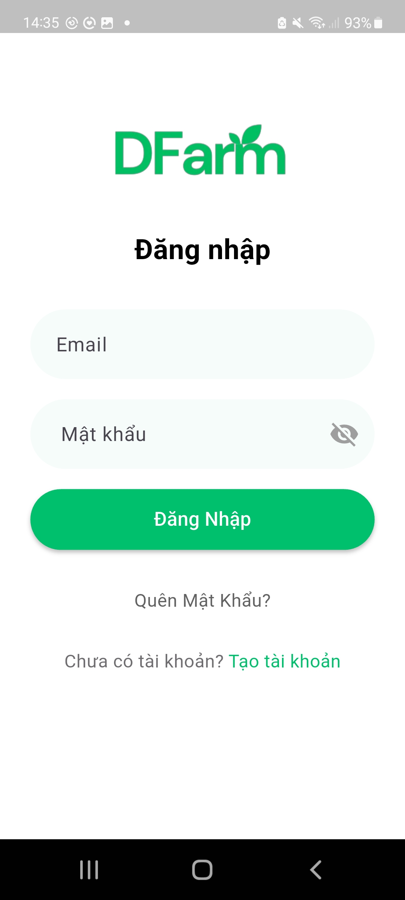

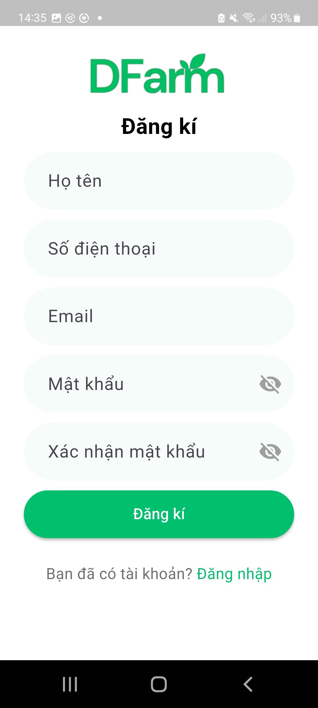

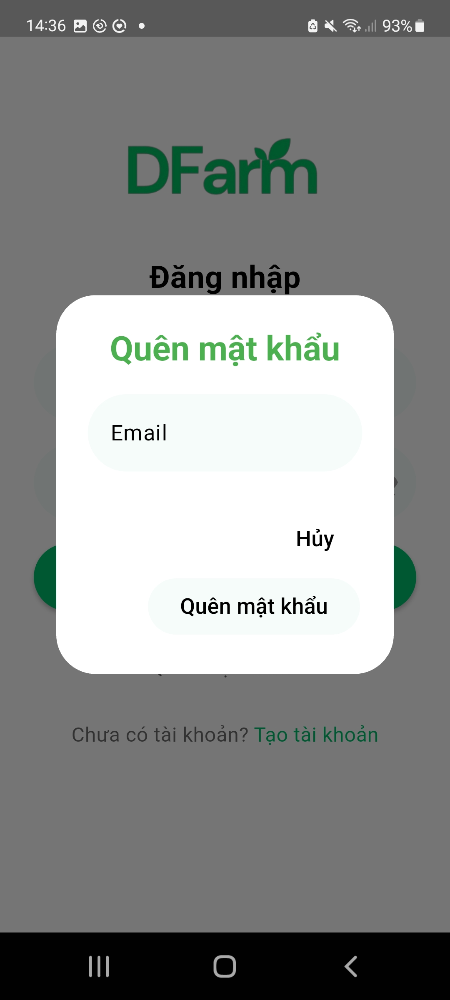

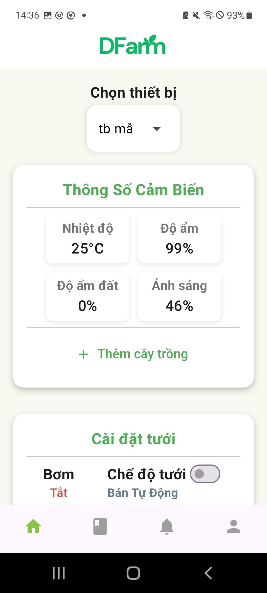

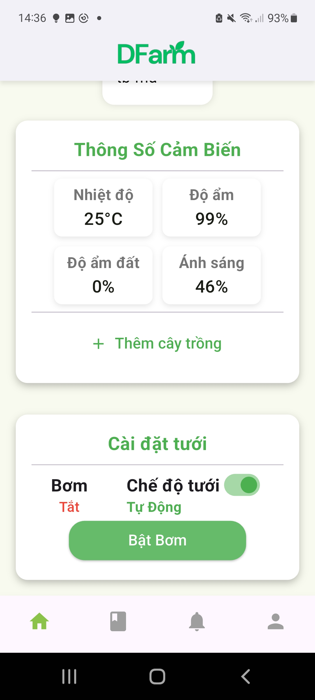

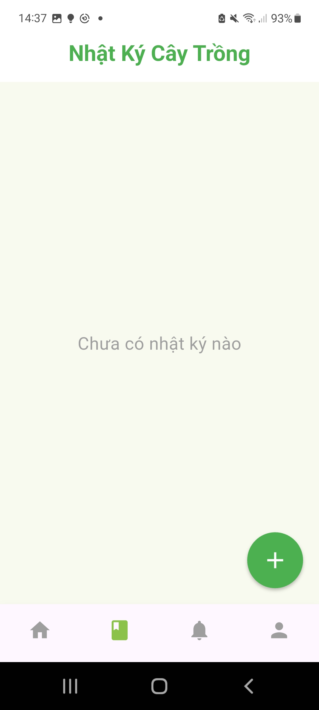 
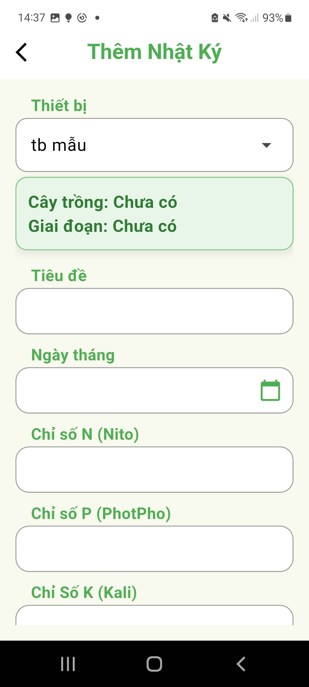 
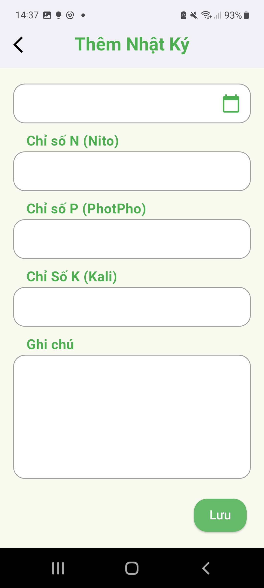 
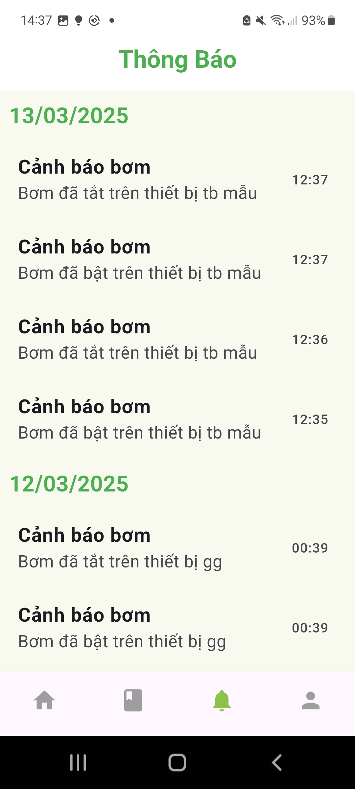 
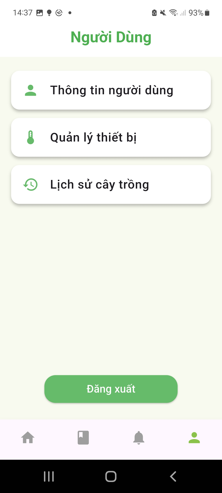 
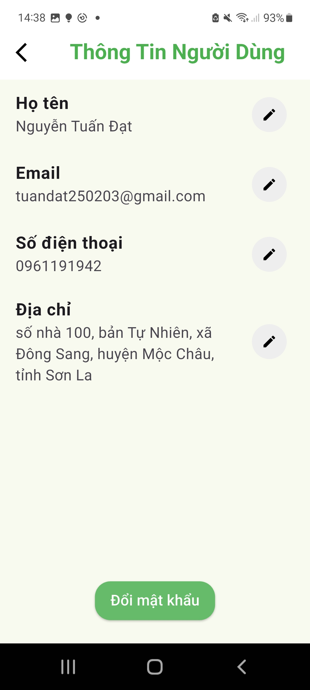 
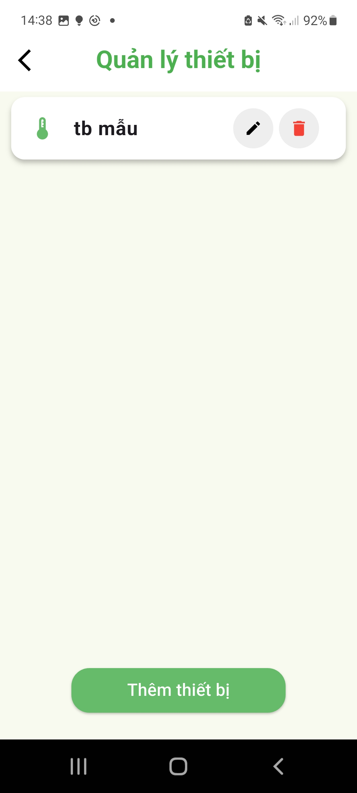 
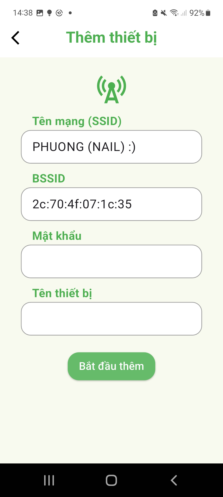 
 
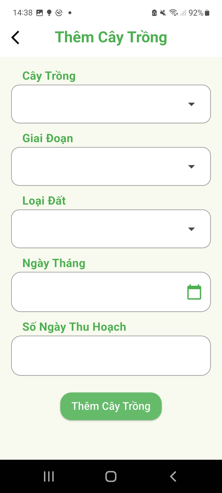 
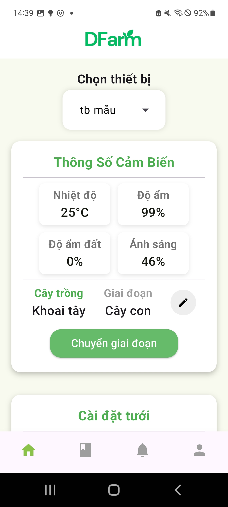 
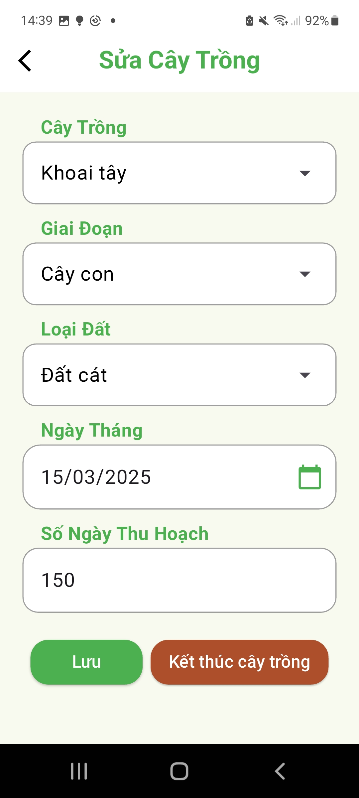 
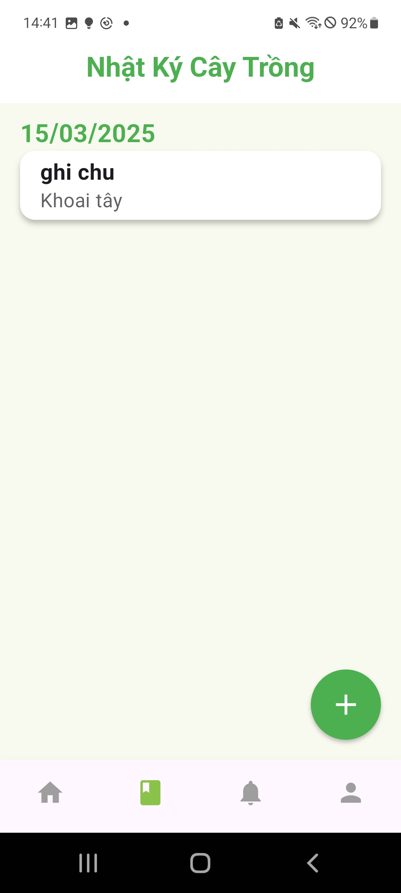 
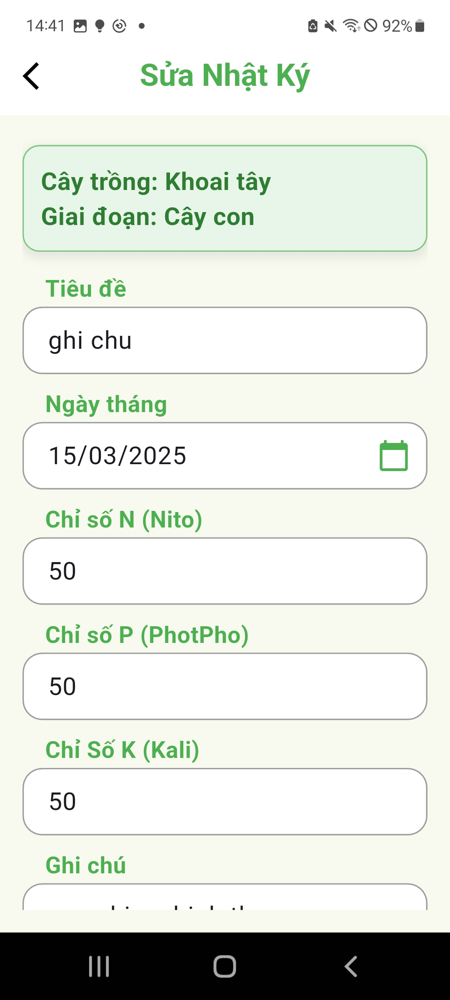 
 
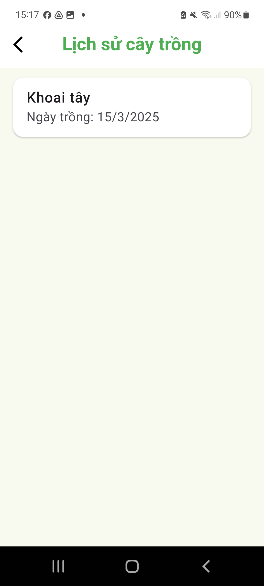